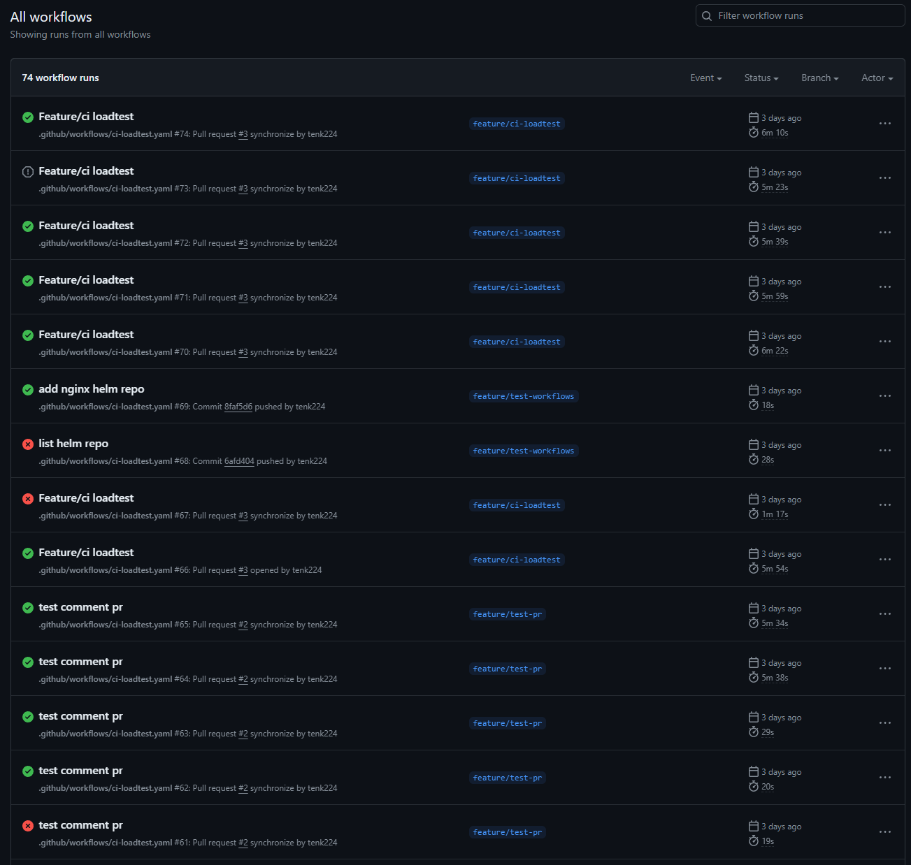
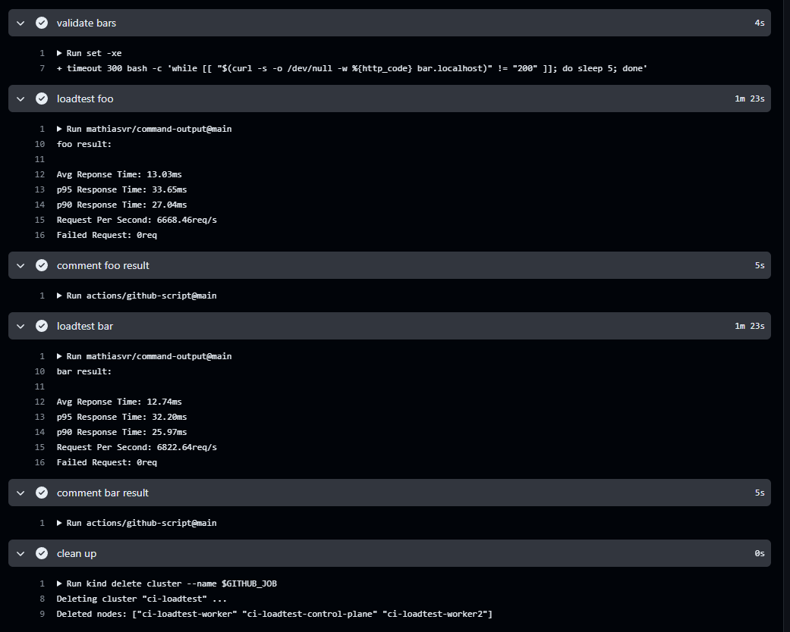

# Assignment
## Prerequisites
- Github Self-Hosted Runner:
  - Ubuntu 22.04
  - Run as instructed when add the github-runner
  - Run the github-runner as root:
    - The reason behind is because adding installed cli path to $PATH is easier.
  - Run `./svc.sh install` for starting the runner by Systemd
  - Kind:
    - Docker
    - go
    - `go install sigs.k8s.io/kind@v0.22.0`
  - Kubectl
  - Helm
  - Grafana k6
  - Edit the appropriate path to `/etc/environment` for the cli to work.

## Step explanation
I will go into detail for steps that need explaining only.

Assumption: `name` will be foo or bar

Steps:
- Checkout
- Create cluster:
  - Create a cluster with port 80 being exposed for port 32080. The port 32080 is the Service type NodePort of the nginx ingress controller.
- Validate cluster:
  - Call kubectl to get the version of both client and server. This will return 1 if it cannot connect to the server. This ensures the api-server is up and running.
- Install ingress-nginx:
  - Install the chart and use the value from `manifests/ingress-nginx.yaml`
  - I use this because I need to change the NodePort number. The Daemonset Kubernets workload does not matter.
- Validate ingress-nginx:
  - This is to check if the ingress-nginx pods are in Running state.
- Install foo and bar:
  - Install foo and bar with the helm chart from the repository
  - I already edited these things in the helm chart so we get a simple command to install the services:
    - Ingress with host `name`.localhost
    - Arg with -text=`name` to return the name of such host
    - Change the url to http://`name`.localhost which it prints once we complete installing the release.
    - Change the probe into using the TCP of port 5678. This is the default port of the image.
- Add host for foo and bar:
  - Add the following entry into `/etc/hosts`:
    > 127.0.0.1 `name`.localhost
- Validate foo and bar:
  - This step will cURL http://`name`.localhost to get the result and it will retry until it gets 200 as response status. Otherwise this step will fail.
- Loadtest foo and bar:
  - Use custom action to store the result to stdout.
  - Use Grafana k6 with setting and custom result from `loadtest.js`
  - Print out the result to stdout 
- Comment foo and result
  - Put loadtest step stdout log to the comment of the pull request.
- Clean up:
  - Remove entries from `/etc/hosts`.
  - Delete the kind k8s cluster.

## Screenshots of work


### All pipeline view


### Logs from the pipeline




### Comment in the pull request


## Limitation and improvement
This is the first time I use github action (syntax and custom action), mange github action runner, kind, grafana k6 and js for custom result so it took me 2 days of doing these things.

- I have to bootstrap a lot of things into the runner (go, kind, helm, k6) so we can pack the bootstrap into the workflow to get the immutable runner:
  - Use [https://github.com/helm/kind-action](https://github.com/helm/kind-action) to get kind to provision the cluster
  - Install helm from workflow
- In case we do not want the immutable runner, we can have another pipeline to provision/patch the AMI of the runner with installed up-to-date cli
- Install the runner as non-root user for better security management
- I could use the runner from another k8s cluster, but since I use Kind for the first time, I am not sure if it has the capability to use the service account to spin another pod for `kind k8s node` and how it handles `kind network`. Need to check docs for this use case.
- Create a custom action to input the name either foo or bar then run the whole thing from install/validate/loadtest/comment.
- Update the loadtest setting to another file for better setting management. The current setting is to ramp up then ramp down users.
- This job can be only run one at a time only. In order to handle multiple workflows at a time, I need to address the following issues:
  - Random port to expose the cluster api-server rather than 80 and must not the same as the existing cluster.
  - Random port for ingress-inginx controller and must not be the same as the existing controller from another cluster.
  - Input context on install and validation step to run the workflows on the target cluster.

Monitoring:

I do not think the resource utilization is relevant since we have to include the runner specifications into the report. We can get load average from the runner to see if it is waiting on anything. Another thing to monitor is the memory usage during the loadtest.

To get the metrics we can do as of the following:
- Install the kube-prometheus-stack, it has a lot of kubernetes CRDs for the Prometheus to automatically scrape the generated metrics.
- Deploy ServiceMonitor
```
apiVersion: monitoring.coreos.com/v1
kind: ServiceMonitor
metadata:
  name: example-app
  labels:
    team: frontend
spec:
  selector:
    matchLabels:
      app: example-app
  endpoints:
  - port: web
```
- Wait for the prometheus-operator to spin up the prometheus instance.
- Wait for the config from the ServiceMonitor to be in the prometheus.
- Query some metrics to validate.
- Run the loadtest and capture the timestamp.
- Query the metrics from the given timestamp and put those metrics to the comment.
This approach slows the pipeline by very much.

Another approach I can think of is to run the performance test from with the service then send the metrics to somewhere like stdout. This depends completely on the what service and framework we run. I may go this way if I am to do the performance test.

## Additional notes
If you need to view the exact logs, please send me the email I will invite you directly to the repository. I will fetch the whole repository to local to include all the branches that I use during the assignments.

## TODO
Proof read the README.md